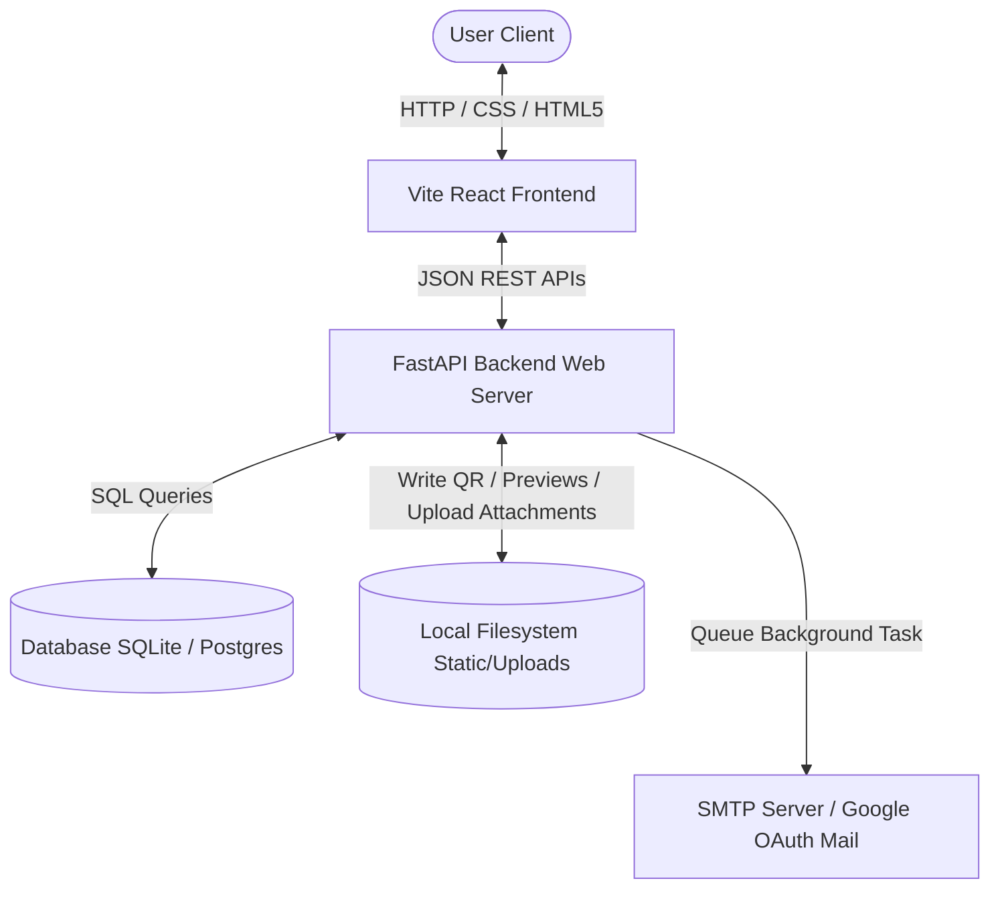
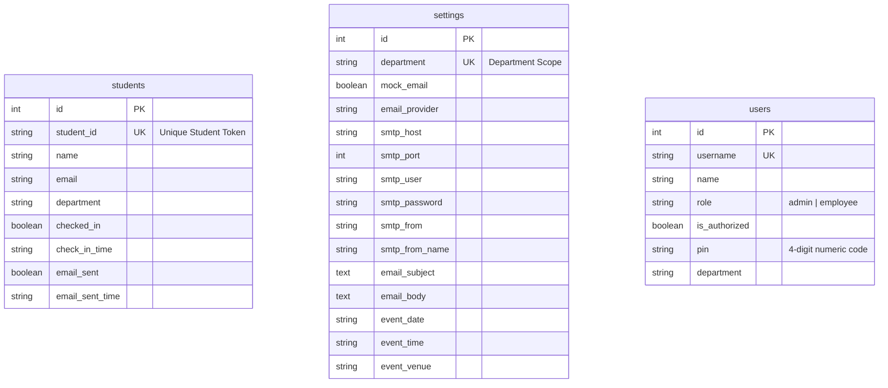
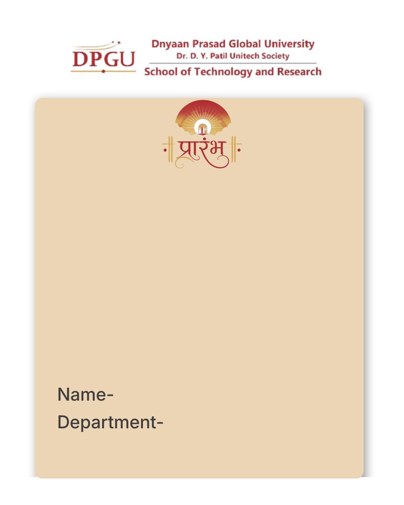
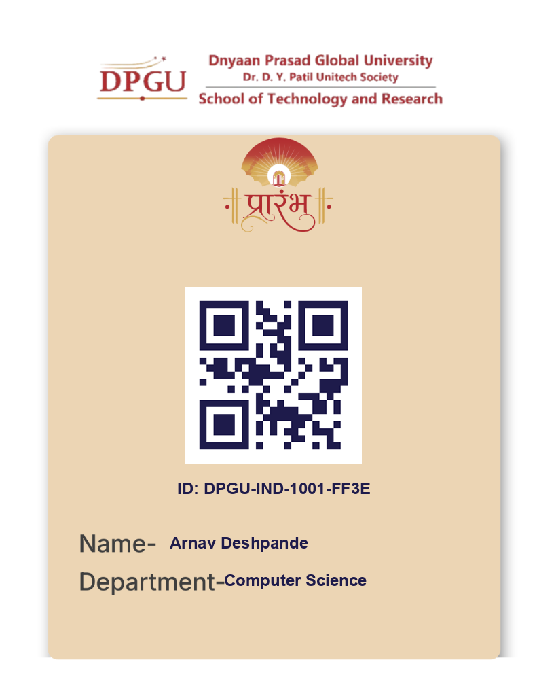

# DPGU STR Induction Management System

[](https://fastapi.tiangolo.com)
[](https://reactjs.org/)
[](https://sqlite.org)
[](https://www.postgresql.org)
[](https://vitejs.dev)
[](LICENSE)

An enterprise-grade, multi-role registration and attendance tracking system designed for the **School of Technology and Research (STR)** at **Dnyan Prasad Global University (DPGU)**. This application manages student roster imports, generates customizable entry passes with embedded QR codes, delivers invitations asynchronously (via SMTP or Google OAuth2), and performs real-time scanner-based attendance check-ins segregated by departments.

---

## Features

### 📋 Student Roster Management
*   **Flexible Import:** Drag-and-drop file upload for Excel (`.xlsx`, `.xls`) or CSV roster lists.
*   **Smart Header Mapping:** Automatically detects and maps columns like `Name`, `Email`, and `Department` (supports fallback default departments).
*   **Duplicate Prevention:** Sanitizes inputs and skips duplicate entries based on email.
*   **Sequential Token Generation:** Automatically generates secure, unique student IDs (e.g., `DPGU-IND-1001-C7F3`).

### 🎫 Automated QR Pass & Email Delivery
*   **Graphic Pass Generation:** Combines student information and a unique QR code onto a customizable card template (`ticket.jpeg`) using PIL (Pillow).
*   **Asynchronous Emailing:** Employs FastAPI `BackgroundTasks` to send invitations concurrently without blocking the main thread.
*   **Hybrid Providers:** Supports sending through standard **SMTP** (e.g., Gmail App Passwords) or secure **Google Gmail API OAuth2** flow.
*   **File Attachments:** Centralized file uploads manager allowing administrators to append PDFs, location maps, or flyers to outgoing emails.
*   **Mock/Dry-Run Mode:** Simulates email dispatch and saves mock preview card images in local storage (`static/sent_emails/`) for review.

### 📷 Live QR Scanner & Attendance Tracker
*   **Webcam Scanner:** High-performance, client-side QR scanner powered by `html5-qrcode`.
*   **Department-Specific Desks:** Restricts check-ins dynamically. If a student belongs to *Computer Science*, they must check in at the *Computer Science* desk, preventing accidental check-ins at wrong queues.
*   **Manual Overrides:** Allows administrators to revert check-ins (check out) or manually register attendance.

### 👥 Departmental Role-Based Access Control (RBAC)
*   **PIN Authentication:** Fast selection list of profiles authenticated via a secure 4-digit PIN.
*   **Hierarchical Roles:**
    *   **System Admin:** Full global system access, dashboard statistics, user management, and settings configuration.
    *   **Department Admin:** Access to dashboard metrics and system configurations filtered to their own department.
    *   **Department Staff (Volunteer/Employee):** Access only to the Live QR Scanner and Attendance Tracker components.
*   **User Management Control:** System admins can dynamically authorize or suspend profiles.

### 🛡 Diagnostics & Export
*   **System Integrity Audit:** Runs detailed diagnosis looking for duplicate IDs, missing QR codes, empty department listings, or invalid email formats.
*   **Styled & Secured Reports:** Generates structured Excel export documents featuring color-coded check-in statuses, auto-adjusted column widths, and strict workbook sheet protection (`Password: DPGU-STR-2026`).

---

## Tech Stack

### Frontend
*   **Core Framework:** React 19 (ES6+ Javascript)
*   **Build Tooling:** Vite 8
*   **Styling:** Vanilla CSS (curated HSL palettes, glassmorphism, responsive dashboard layout)
*   **Scanning Library:** `html5-qrcode`

### Backend
*   **API Framework:** FastAPI (Python 3.x)
*   **Web Server:** Uvicorn
*   **Data Processing:** Pandas (roster parse), openpyxl (styled Excel reports)
*   **Graphics & QR:** Pillow (card generation), qrcode (QR vector rendering)
*   **Mail Client:** smtplib, google-api-python-client (Gmail API Integration via OAuth2)

### Database
*   **Local/Development:** SQLite3 (uses python built-in drivers)
*   **Production:** PostgreSQL (psycopg2-binary connection adapter)

### Authentication
*   Local profile selection authenticated via 4-digit numeric PIN codes. State is serialized and cached in browser `localStorage`.

---

## Project Structure

```text
dpgu-str-induction-management-system/
├── backend/                        # Backend API Application
│   ├── static/                     # Static files directory
│   │   ├── qrcodes/                # Generated QR Code passes
│   │   └── sent_emails/            # Mock email preview PNG cards
│   ├── uploads/                    # Upload directories
│   │   └── attachments/            # PDF and image attachments for emails
│   ├── config.py                   # Environment and folder configurations
│   ├── database.py                 # SQLite/PostgreSQL initialization and CRUD helpers
│   ├── email_service.py            # Pillow card generation and SMTP mail dispatch
│   ├── gmail_oauth.py              # Google OAuth2 authorization handler for Gmail API
│   ├── main.py                     # FastAPI routes, middleware, and business logic
│   ├── models.py                   # Pydantic schemas and serialization definitions
│   ├── requirements.txt            # Python dependencies package list
│   └── test_backend.py             # Integration and logic tests script
├── frontend/                       # Frontend SPA React Application
│   ├── public/                     # Public assets
│   ├── src/                        # React source components
│   │   ├── assets/                 # App icons and media
│   │   ├── components/             # Reusable view panels
│   │   │   ├── AttendanceView.jsx  # Student list, filters, and manual checkin
│   │   │   ├── DashboardView.jsx   # Import file, template editor, attachments list
│   │   │   ├── ScannerView.jsx     # QR camera scanner panel
│   │   │   ├── SettingsView.jsx    # System resets and SMTP configuration
│   │   │   ├── SystemHealthView.jsx# Database diagnostic stats
│   │   │   └── UserManagementView.jsx # Auth user authorization toggle panel
│   │   ├── App.css                 # Global styling classes and CSS variables
│   │   ├── App.jsx                 # View selector, toast alerts, login portal
│   │   ├── index.css               # Main styling wrapper
│   │   └── main.jsx                # React DOM renderer entry
│   ├── package.json                # Frontend package dependencies configuration
│   └── vite.config.js              # Vite bundler options
├── ticket.jpeg                     # Card base template image
└── Arnav_Deshpande_Induction_Pass.png # Sample generated student entry card pass
```

---

## Architecture

### System Data Flow



### Request Flow
1. **Roster Upload:** Roster files are processed by Pandas. Each entry is validated, saved to the database, and assigned a sequential ID.
2. **Pass Generation:** Pillow loads the base template `ticket.jpeg`, embeds the QR code containing the Student ID, overlays text overlays, and saves to static files.
3. **Check-In Execution:** The scanner reads the QR code, posts the ID to `/api/students/checkin`. The backend processes checking constraints (already checked in? belongs to another department's desk?) inside a `FOR UPDATE` transactional lock block.

### Database Interaction Flow
`database.py` dynamically handles engine differences:
*   **PostgreSQL Wrapper:** Maps parameters to `%s`, implements row-level locking via `FOR UPDATE` and serializes query outputs.
*   **SQLite Wrapper:** Automatically strips unsupported queries like `FOR UPDATE` (as SQLite locks the database file on write operations) and leverages `sqlite3.Row` for dictionary conversions.

---

## Installation

### Prerequisites
*   Python 3.10+
*   Node.js 18+

### Step 1: Clone the Repository
```bash
git clone https://github.com/yourusername/dpgu-str-induction-management-system.git
cd dpgu-str-induction-management-system
```

### Step 2: Configure the Backend
1. Navigate to the backend folder:
   ```bash
   cd backend
   ```
2. Create and activate a python virtual environment:
   ```bash
   python -m venv venv
   # On Windows:
   venv\Scripts\activate
   # On macOS/Linux:
   source venv/bin/activate
   ```
3. Install dependencies:
   ```bash
   pip install -r requirements.txt
   ```
4. Setup environment variables:
   ```bash
   cp .env.example .env
   ```
   Modify `.env` to match your local setup (refer to the **Environment Variables** section).

### Step 3: Run Backend Tests
Run the automated test runner to ensure the environment is fully set up and operational:
```bash
python test_backend.py
```

### Step 4: Start Backend Server
```bash
uvicorn main:app --reload --host 127.0.0.1 --port 8000
```
The API documentation will be available at [http://127.0.0.1:8000/docs](http://127.0.0.1:8000/docs).

### Step 5: Configure and Run Frontend
1. Navigate to the frontend folder:
   ```bash
   cd ../frontend
   ```
2. Install Node packages:
   ```bash
   npm install
   ```
3. Run linting checks:
   ```bash
   npm run lint
   ```
4. Start Vite development server:
   ```bash
   npm run dev
   ```
The frontend application will boot up at [http://localhost:5173](http://localhost:5173).

---

## Environment Variables

### Backend Environment Variables (`backend/.env`)

| Variable | Type | Default Value | Description |
| :--- | :--- | :--- | :--- |
| `DATABASE_URL` | String | `sqlite:///./induction_system.db` | PostgreSQL or SQLite connection DSN. |
| `DB_HOST` | String | - | PostgreSQL host address (alternative config). |
| `DB_PORT` | String | `5432` | PostgreSQL host port (alternative config). |
| `DB_USER` | String | - | PostgreSQL user (alternative config). |
| `DB_PASSWORD` | String | - | PostgreSQL password (alternative config). |
| `DB_NAME` | String | - | PostgreSQL database name (alternative config). |
| `DB_PATH` | String | `induction_system.db` | Custom SQLite DB filename. |
| `ALLOWED_ORIGINS`| String | `http://localhost:5173` | Comma-separated list of additional CORS permitted sites. |
| `MOCK_EMAIL` | Boolean | `True` | If `True`, does not send actual emails but outputs PNG passes to preview folders. |
| `SMTP_HOST` | String | `smtp.gmail.com` | Outgoing SMTP host address. |
| `SMTP_PORT` | Integer| `587` | Outgoing SMTP port. |
| `SMTP_USER` | String | - | SMTP Username/Email address. |
| `SMTP_PASSWORD` | String | - | SMTP App Password. |
| `SMTP_FROM` | String | `induction@dpgu.edu.in` | Sender email address. |
| `SMTP_FROM_NAME` | String | `DPGU STR Induction Team`| Sender display name. |

---

## API Documentation

<details>
<summary><b>🔐 Authentication & User APIs</b> (Click to Expand)</summary>

### 1. Get Auth Profiles
*   **Method:** `GET`
*   **Route:** `/api/auth/profiles`
*   **Description:** Fetch all configured user accounts (admins, staff/volunteers) to populate the login dropdown list.
*   **Auth Required:** No
*   **Response Model:** `List[UserResponse]`
*   **Example Response:**
    ```json
    [
      {
        "id": 1,
        "username": "admin",
        "name": "System Admin",
        "role": "admin",
        "is_authorized": true,
        "department": null
      }
    ]
    ```

### 2. Login User
*   **Method:** `POST`
*   **Route:** `/api/auth/login`
*   **Description:** Authenticate profile using a 4-digit PIN.
*   **Auth Required:** No
*   **Request Body (`UserLoginRequest`):**
    ```json
    {
      "username": "admin",
      "pin": "0000"
    }
    ```
*   **Response Model:** `UserResponse`
*   **Example Response:**
    ```json
    {
      "id": 1,
      "username": "admin",
      "name": "System Admin",
      "role": "admin",
      "is_authorized": true,
      "department": null
    }
    ```

### 3. List Employees
*   **Method:** `GET`
*   **Route:** `/api/users`
*   **Description:** Lists all employee accounts.
*   **Query Parameters:** `dept` (Optional - filter by department name)
*   **Auth Required:** Yes (Managed client-side)
*   **Response Model:** `List[UserResponse]`

### 4. Toggle User Authorization Status
*   **Method:** `POST`
*   **Route:** `/api/users/{username}/toggle-auth`
*   **Description:** Toggles `is_authorized` flag for a staff profile (block/unblock access).
*   **Auth Required:** Yes (Managed client-side)
*   **Response:**
    ```json
    {
      "success": true,
      "username": "cs_emp1",
      "is_authorized": false
    }
    ```
</details>

<details>
<summary><b>🎓 Student & Attendance APIs</b> (Click to Expand)</summary>

### 1. Upload Student Roster
*   **Method:** `POST`
*   **Route:** `/api/students/upload`
*   **Description:** Import an Excel/CSV list of student registrations.
*   **Query Parameters:** `dept` (Optional - default department if missing in spreadsheet rows)
*   **Request Body:** `multipart/form-data` containing `file`
*   **Response Model:** `StatsResponse`

### 2. Retrieve Student List
*   **Method:** `GET`
*   **Route:** `/api/students`
*   **Description:** Query student database with search and status filters.
*   **Query Parameters:**
    *   `search` (Optional string)
    *   `checked_in` (Optional boolean)
    *   `email_sent` (Optional boolean)
    *   `dept` (Optional string)
*   **Response Model:** `List[StudentResponse]`

### 3. Trigger Invitation Emails
*   **Method:** `POST`
*   **Route:** `/api/students/send-emails`
*   **Description:** Initiates generation and emailing of QR passes in background for unsent students.
*   **Query Parameters:** `dept` (Optional - limits dispatch to department)
*   **Response:**
    ```json
    {
      "message": "Queued 15 emails to send in the background."
    }
    ```

### 4. Student Attendance Check-in
*   **Method:** `POST`
*   **Route:** `/api/students/checkin`
*   **Description:** Validates student QR code and checks them in. Enforces desk department match checking.
*   **Query Parameters:** `dept` (Optional - active checking desk department)
*   **Request Body (`StudentCheckIn`):**
    ```json
    {
      "student_id": "DPGU-IND-1002-3BFF"
    }
    ```
*   **Response Model:** `CheckInResponse`
*   **Example Response:**
    ```json
    {
      "success": true,
      "message": "Welcome Jane Doe! Attendance marked successfully.",
      "student": {
        "id": 2,
        "student_id": "DPGU-IND-1002-3BFF",
        "name": "Jane Doe",
        "email": "jane@dpgu.edu.in",
        "department": "Computer Science",
        "checked_in": true,
        "check_in_time": "2026-08-03T00:25:00",
        "email_sent": true,
        "email_sent_time": "2026-08-03T00:21:00"
      }
    }
    ```

### 5. Check-out Student (Revert Check-in)
*   **Method:** `POST`
*   **Route:** `/api/students/checkout`
*   **Description:** Reverts check-in status back to pending (`checked_in = False`).
*   **Request Body (`StudentCheckIn`):**
    ```json
    {
      "student_id": "DPGU-IND-1002-3BFF"
    }
    ```
*   **Response Model:** `CheckInResponse`

### 6. Export Attendance Report
*   **Method:** `GET`
*   **Route:** `/api/students/export`
*   **Description:** Download stylized, password-protected Excel roster sheet.
*   **Response:** Binary `.xlsx` file response
</details>

<details>
<summary><b>⚙ Settings & System Management APIs</b> (Click to Expand)</summary>

### 1. Get Settings
*   **Method:** `GET`
*   **Route:** `/api/settings`
*   **Description:** Load SMTP & Template variables for a department.
*   **Response Model:** `EmailConfigRequest`

### 2. Save Settings
*   **Method:** `POST`
*   **Route:** `/api/settings`
*   **Description:** Save SMTP credentials and event metadata details.
*   **Request Body:** `EmailConfigRequest`

### 3. Test SMTP Credentials
*   **Method:** `POST`
*   **Route:** `/api/settings/test-smtp`
*   **Description:** Validates connection details by sending a test email to the user login address.
*   **Request Body:** `EmailConfigRequest`
*   **Response:**
    ```json
    {
      "success": true,
      "message": "Test email sent successfully via SMTP to admin@dpgu.edu.in"
    }
    ```

### 4. Fetch Previews (Mock Mode)
*   **Method:** `GET`
*   **Route:** `/api/preview-emails`
*   **Description:** List generated pass previews located in local filesystem.
*   **Response:**
    ```json
    [
      {
        "filename": "john@dpgu.edu.in_DPGU-IND-1001-A2DF.png",
        "email": "john@dpgu.edu.in",
        "student_id": "DPGU-IND-1001-A2DF",
        "file_url": "/static/sent_emails/john@dpgu.edu.in_DPGU-IND-1001-A2DF.png"
      }
    ]
    ```

### 5. Clear Previews
*   **Method:** `POST`
*   **Route:** `/api/preview-emails/clear`
*   **Description:** Wipe mock email files from backend storage folder.

### 6. System Reset
*   **Method:** `POST`
*   **Route:** `/api/students/reset`
*   **Description:** Wipes database tables and deletes generated QR and preview passes.
*   **Query Parameters:** `dept` (Optional - only wipes records matching department)

### 7. File Attachments upload/delete
*   *   `GET /api/attachments` - List current upload attachment files.
    *   `POST /api/attachments/upload` - Send custom PDF file as payload.
    *   `DELETE /api/attachments/{filename}` - Delete file from filesystem.
</details>

<details>
<summary><b>🩺 Diagnostic Health & Integrity APIs</b> (Click to Expand)</summary>

### 1. System Health Status
*   **Method:** `GET`
*   **Route:** `/api/system/health`
*   **Description:** Validates connectivity between FastAPI and the active database engines.
*   **Response:**
    ```json
    {
      "status": "online",
      "database": "sqlite",
      "timestamp": "2026-08-03T00:26:00"
    }
    ```

### 2. System Integrity Diagnostics
*   **Method:** `GET`
*   **Route:** `/api/system/integrity`
*   **Description:** Scans the active database rows against local disk files to identify duplicates or missing assets.
*   **Response:**
    ```json
    {
      "db_status": "online",
      "db_type": "sqlite",
      "total_students": 150,
      "total_qr_generated": 149,
      "total_emails_sent": 120,
      "total_attendance": 45,
      "duplicates": [],
      "missing_qrcodes": [
        {
          "student_id": "DPGU-IND-1099-XYZW",
          "name": "Alex Smith",
          "issue": "Missing QR Code file"
        }
      ],
      "missing_emails": [],
      "missing_departments": [],
      "last_sync_time": "2026-08-03T00:26:05"
    }
    ```

### 3. Readiness Check Summary
*   **Method:** `POST`
*   **Route:** `/api/system/integrity/check`
*   **Description:** Summarizes diagnostics and triggers a boolean `ready` flag representing whether the system is set up for the live event.
</details>

---

## Database Schema



### Table 1: `students`
Tracks student registrations, card deliveries, and checked-in attendance timestamps.
*   **Primary Key:** `id` (Auto-increment Integer)
*   **Constraints:** `student_id` is unique and not nullable.

### Table 2: `settings`
Holds SMTP and email invitation layout configuration templates. Allows granular department-level setups (e.g. specialized event date/venue per stream).
*   **Primary Key:** `id` (Auto-increment Integer)
*   **Constraints:** `department` is unique.

### Table 3: `users`
Saves authenticated employee profiles and system admins.
*   **Primary Key:** `id` (Auto-increment Integer)
*   **Constraints:** `username` is unique and not nullable. `pin` is standard 4-digit code.

---

## Authentication & Authorization

```text
               +-----------------------------------+
               |        Start Application          |
               +-----------------------------------+
                                 |
                                 v
               +-----------------------------------+
               |     Fetch Profiles from API       |
               +-----------------------------------+
                                 |
                                 v
               +-----------------------------------+
               | Select Profile & Enter 4-Digit PIN|
               +-----------------------------------+
                                 |
                                 v
               +-----------------------------------+
               |       Validate PIN on Backend     |
               +-----------------------------------+
                   /                           \
         (Valid PIN)                       (Invalid PIN)
               /                                 \
              v                                   v
+-----------------------------+         +--------------------+
|  Is User is_authorized?     |         | Raise 401 Error    |
+-----------------------------+         +--------------------+
    /                     \
 (Yes)                    (No)
   /                         \
  v                           v
+---------------------+   +--------------------+
| Load Session        |   | Raise 403 Forbidden|
| Cache in LocalStore |   +--------------------+
+---------------------+
  |                 |
  | (Role: Admin)   | (Role: Employee)
  v                 v
+-----------------+ +-----------------+
| Full access to  | | Restrained      |
| settings, stats | | QR Scanning and |
| & health panels | | student queries |
+-----------------+ +-----------------+
```

1. **Authentication Mode:** The system uses PIN-based verification for profiles instead of complex passwords.
2. **Access Middleware:** Since the system runs locally on a closed network during the event, authentication is simplified for volunteers:
    *   Volunteers sign in by picking their profile name and inputting their numeric code.
    *   The frontend stores the returned profile JSON object in `localStorage`.
    *   Client-side routing restricts access to non-administrative staff.
3. **Desk Isolation:** When a volunteer checks in a student via the scan API, the query specifies their station's department. The backend ensures the student's department matches the active station desk.

---

## Error Handling
*   **Validation Errors:** Pydantic automatically handles invalid request payloads, throwing a `422 Unprocessable Entity` response.
*   **SMTP Connection Failures:** Catching socket time-outs during dispatch. If delivery fails, the status stays as `Pending` (`email_sent = False`) and writes a `FAILED_SMTP_*.png` card in mock previews for volunteer analysis.
*   **Database Constraints:** Isolated migration try-catch wrappers prevent schema execution crashes when migrating from SQLite to Postgres.
*   **Double Check-in Prevention:** Lock constraints via database checks prompt volunteers immediately with visual warning popups if a card is scanned twice.

---

## Security
*   **Transactional Row Locks:** Employs database row locking (`FOR UPDATE` on supporting Postgres) to prevent concurrent double-scans of the same ticket token on different desks.
*   **Sheet Protection:** Excel reports generated through `openpyxl` are protected with a workbook sheet-level password lock (`DPGU-STR-2026`).
*   **Safe File Uploads:** Uploaded filenames are sanitized (replacing spaces with underscores) and processed via path-traversal resistant directory joins.
*   **Dynamic Access Authorization:** System administrators can dynamically toggle account access flags (`is_authorized`) on the fly, locking out compromised volunteer profiles.

---

## Configuration

*   **`requirements.txt`:** Manages python packages, including libraries like `fastapi`, `uvicorn`, `psycopg2-binary`, `pandas`, `openpyxl`, `pillow`, `qrcode`, and `google-api-python-client`.
*   **`package.json`:** Manages frontend React dependencies, Vite configuration, and **Oxlint** scripts for ultra-fast JS code quality validation.
*   **`.env`:** Contains connection strings, allowed CORS origins, and SMTP host details.

---

## Running Tests

Automated backend unit/integration tests can be run to verify database setup, file generation, and check-in constraints.

Run the test suite directly from your terminal:
```bash
cd backend
python test_backend.py
```

The script runs diagnostics:
1. Verifies database setup and table schemas.
2. Performs data insertions.
3. Generates mock QR and invitation pass files.
4. Validates student check-in status updates.
5. Auto-cleans test files upon completion.

---

## Deployment

### Backend Deployment (e.g., Render)
1. Set up a Web Service on Render pointing to your repository.
2. Select the **Python** environment.
3. Configure the start command:
   ```bash
   uvicorn backend.main:app --host 0.0.0.0 --port $PORT
   ```
4. Attach a PostgreSQL database on Render.
5. Bind environment variables (`DATABASE_URL`, `MOCK_EMAIL=False`, etc.) to the Render service settings panel.

### Frontend Deployment (e.g., Vercel / Netlify)
1. Add a new project on Vercel importing the repository.
2. Set the root directory to `frontend`.
3. Set the build command to `npm run build` and output directory to `dist`.
4. Configure frontend environment variables:
   *   `VITE_API_BASE_URL`: Set to your deployed backend Render URL.

---

## Screenshots

Below are sample assets generated by the card rendering service:

### 1. Base Ticket Template (`ticket.jpeg`)


### 2. Sample Generated Entry Pass (`Arnav_Deshpande_Induction_Pass.png`)


---

## Future Improvements
*   **Session Token Auth:** Implement JSON Web Tokens (JWT) or secure HTTP-only cookies on top of the PIN-based authentication system.
*   **Multi-Event Configuration:** Allow dynamic creation of custom events, dates, and venues directly from the UI without database wipes.
*   **Automated DB Migrations:** Add **Alembic** support to handle schema revisions cleanly without custom SQL try-catch updates in database.py.
*   **Offline Mode:** Cache check-in records in browser IndexedDB when local network connections are disrupted and sync automatically when connection restores.

---

## Contributing
1. Fork the project repository.
2. Create a feature branch: `git checkout -b feature/NewFeature`.
3. Commit your changes: `git commit -m 'Add NewFeature'`.
4. Push the branch: `git push origin feature/NewFeature`.
5. Open a Pull Request for review.

---

## License

This project is licensed under the MIT License - see the [LICENSE](LICENSE) file placeholder for details.
